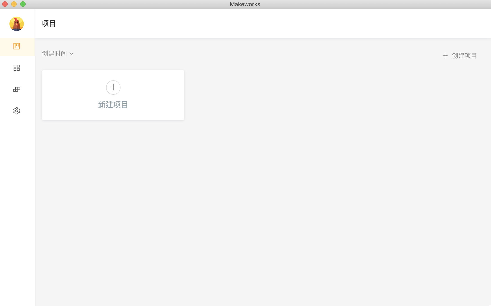
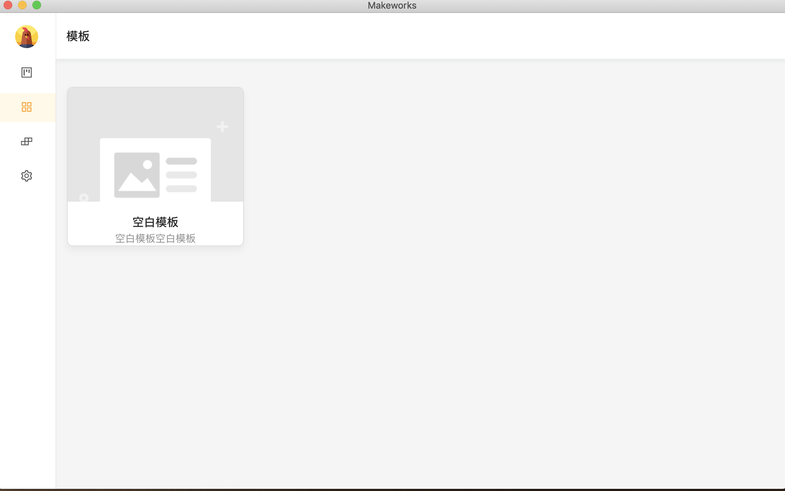
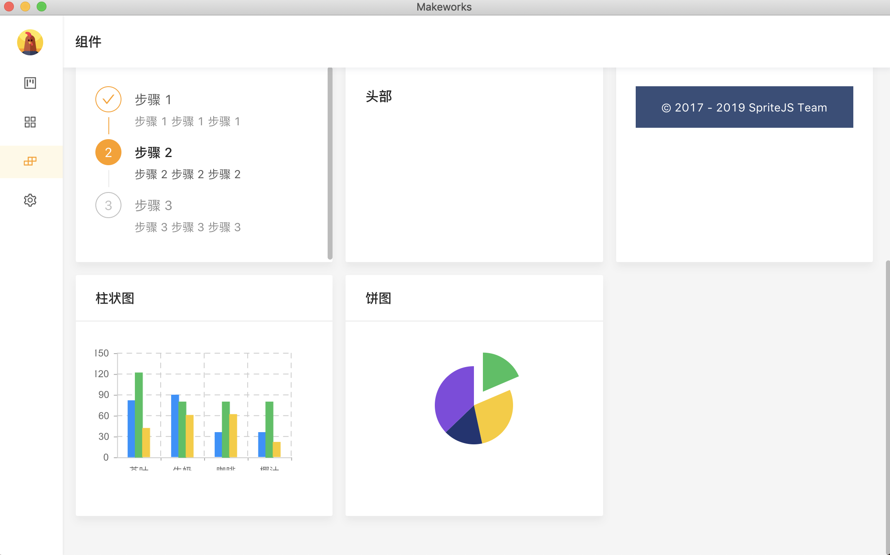
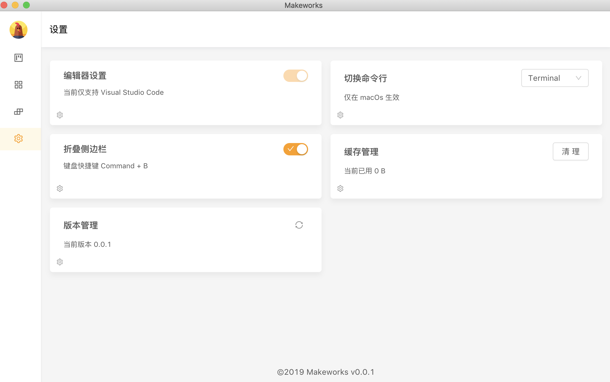

    

<h2 align="center">Makeworks</h2>

`Makeworks` 是基于 `React` 的可视化项目搭建平台，使用 [electron-react-boilerplate](https://github.com/justemit/electron-react-boilerplate) 构建。

## 界面与使用

如需查看视频，项目 `docs` 文件夹内包含 `480p` 和 `1080p` 两种分辨率的视频，可以下载观看。

<video src="makeworks-480p.mov"></video>

## 下载使用

当前仅构建 [macOS 上安装包](./release/Makeworks-0.0.1.dmg)。

## LICENSE

MIT
